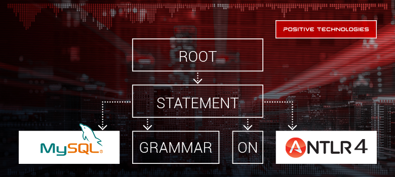

# Грамматика MySQL на ANTLR 4



[Межсетевой экран уровня приложений](https://en.wikipedia.org/wiki/Application_firewall)
предназначен для анализа и фильтрации трафика в отношении какого-либо приложения
или класса приложений, например [веб-приложений](https://habrahabr.ru/company/pt/blog/269165/)
или [СУБД](https://speakerdeck.com/dnkolegov/database-firewall-from-scratch).
При его построении возникает необходимость *разговаривать* на языке этого приложения.
Для реляционной СУБД таким языком становится диалект SQL. Предположим,
что необходимо построить межсетевой экран для СУБД. В этом случае потребуется
распознавать и анализировать предложения SQL для принятия решения об их
соответствии заданной политике безопасности. В зависимости от решаемых
задач (например, обнаружение атак типа SQL-инъекция, управление доступом,
корреляция SQL- и HTTP-запросов) будет необходима та или иная глубина анализа SQL.
Так или иначе, потребуется выполнять лексический, синтаксический и семантический
анализ предложений SQL.

<cut>

* [Введение](#Введение)
  * [Формальная грамматика языка](#Формальная-грамматика-языка)
  * [Используемая терминология](#Используемая-терминология)
  * [Язык MySQL](#Язык-mysql)
* [ANTLR](#antlr)
* [Лексер](#Лексер)
  * [С чего начать](#С-чего-начать)
  * [Идентификаторы с точкой](#Идентификаторы-с-точкой)
  * [Строки](#Строки)
  * [Ключевые слова](#Ключевые-слова)
  * [Специальный тип комментария в MySQL](#Специальный-тип-комментария-в-mysql)
  * [Регистронезависимость](#Регистронезависимость)
* [Парсер](#Парсер)
  * [Структура текста на языке MySQL](#Структура-текста-на-языке-mysql)
  * [Типы предложений в MySQL](#Типы-предложений-в-mysql)
  * [SELECT](#Select)
  * [Выражения](#Выражения)
  * [UNION](#Union)
  * [Использование грамматики](#Использование-грамматики)
* [Заключение](#Заключение)

## Введение

### Формальная грамматика языка

Для того чтобы получить полное представление о структуре языка и проводить
его анализ, можно использовать формальную грамматику этого языка.
С ее помощью можно как порождать предложения языка, так и, воспользовавшись
[синтаксическим анализатором](https://habrahabr.ru/company/pt/blog/210772/#parsing-theory),
распознавать предложения в нем.

Согласно [иерархии Хомского](https://ru.wikipedia.org/wiki/%D0%98%D0%B5%D1%80%D0%B0%D1%80%D1%85%D0%B8%D1%8F_%D0%A5%D0%BE%D0%BC%D1%81%D0%BA%D0%BE%D0%B3%D0%BE),
выделяют четыре основных типа языков и, соответственно, четыре типа грамматик.
Грамматики отличаются своими порождающими возможностями.
MySQL является контекстно-зависимым языком. Тем не менее, перечень языковых
конструкций, которые могут быть порождены только контекстно-зависимой
грамматикой, невелик.
Как правило, на практике используются языковые конструкции, для порождения  которых
достаточно контекстно-свободной грамматики.
В данной статье описываются детали разработки контекстно-свободной грамматики
для MySQL.

### Используемая терминология

Язык определяется на основе алфавита &mdash; множества символов. Буквы алфавита
объединяются в значащие последовательности, называемые лексемами.
Лексемы могут быть разных типов (идентификаторы, строки, ключевые слова и т. п.).
Токеном называется кортеж, состоящий из лексемы и имени типа.
Фраза &mdash; это последовательность лексем, расположенных в особом
порядке. Из фраз могут быть построены предложения. Далее под предложением
понимается некоторая законченная последовательность лексем, которая в контексте
заданного языка имеет самостоятельное значение. Понятие `предложение` имеет
смысл только в прикладной сфере.

Приложения, построенные на основе какого-либо
языка, оперируют предложениями этого языка, например выполняют или интерпретируют
их. Фразы, с прикладной точки зрения, являются незаконченными конструкциями,
они могут являться частью предложения. Но при построении грамматики
удобно использовать именно фразы. По сути, фразы и предложения не
отличаются с точки зрения грамматики &mdash; они соответствуют некоторым ее правилам,
в правой части которых присутствуют нетерминальные символы.

Использование языка предполагает построение или распознавание предложений.
Задача распознавания предполагает, что на вход подается
последовательность лексем, а на выходе выдается ответ на вопрос, *является
ли эта последовательность набором корректных предложений в этом языке*.

### Язык MySQL

Язык MySQL &mdash; это диалект языка SQL для написания запросов к СУБД MySQL.
Под языком SQL подразумевается стандарт или, формально,
[серия стандартов ISO/IEC 9075 “Information technology – Database languages – SQL”](https://en.wikipedia.org/wiki/ISO/IEC_9075).

[Диалект MySQL](https://dev.mysql.com/doc/refman/5.7/en/compatibility.html) &mdash;
это конкретная реализация стандарта с некоторыми ограничениями и дополнениями.
Большая часть предложений MySQL может быть описана контекстно-свободной грамматикой,
но есть некоторые предложения, для описания которых требуются правила
контекстно-зависимой грамматики.
Если говорить простым языком, то, если лексема
влияет на дальнейшее распознавание фраз, такая фраза описывается
правилом контекстно-зависимой грамматики.

В MySQL есть некоторые выражения, построенные по этому принципу. Например:

```sql
DELIMITER SOME_LITERAL
```

В данном случае требуется запомнить `SOME_LITERAL`, поскольку в дальнейших
предложениях в качестве символа их завершения должен будет использоваться
литерал `SOME_LITERAL`, а не `;`.

В процедурном расширении операторы
циклов и блочные предложения могут быть помечены метками. Их структура выглядит
следующим образом:

```text
label somephrases label
```

В данном случае идентификаторы меток должны быть одинаковыми. Вывести такое
предложение можно только в контекстно-зависимой грамматике.

## ANTLR

Для разработки MySQL-парсера был выбран генератор парсеров [ANTLR](http://www.antlr.org/).
Главные преимущества данного генератора:

* [свободная лицензия BSD](http://www.antlr.org/license.html);
* [поддержка нескольких целевых языков (рантаймов)](https://github.com/antlr/antlr4/blob/master/doc/targets.md);
* [хорошая документация](https://github.com/antlr/antlr4/tree/master/doc).

ANTLR предполагает двухэтапный алгоритм генерации распознающего кода.
Сначала описывается лексическая структура языка, то есть определяется,
*что* является токенами.
Далее описывается синтаксическая структура языка, то есть распознанные токены
группируются в предложения. Лексическая и синтаксическая структуры в ANTLR
описываются с помощью правил. Лексическая структура определяется
типом (описателем лексемы) и значением. Для описания значения используется
язык с элементами регулярных выражений, но с поддержкой рекурсии.
Правило синтаксической структуры составляется из описателей лексем на
основе правил построения предложений в ANTLR 4,
позволяющих определить структуру расположения лексем в предложении
или фразе внутри предложения.

При построении правил следует учесть базовый принцип лексического анализа,
реализованный в том числе и в ANTLR. Лексер в первую очередь
пытается распознать наиболее длинную последовательность символов из входного
потока, подходящую под какое-либо лексическое правило. Если же таких правил
несколько, то задействуется первое в порядке определения.

Без использования семантических предикатов в ANTLR можно построить только
контекстно-свободную грамматику. Плюсом является то, что в этом случае
полученная грамматика будет независимой от среды выполнения.
Предлагаемая в статье грамматика для диалекта MySQL построена без использования
семантических предикатов.

## Лексер

### С чего начать

При разработке грамматики первое, что нужно сделать, &mdash; это определить
перечень типов лексем, встречающихся в языке. При распознавании лексем на
вход распознавателя будут поступать символы алфавита языка, из которых нужно
составлять лексемы; при этом символы, не участвующие в составлении
лексем, можно отфильтровать. Такими символами являются пробельные символы
и комментарии. После фильтрации в дальнейшем анализе будут
участвовать только значимые лексемы языка. Отфильтровать пробельные
символы и комментарии можно так:

```ANTLR
SPACE:          [ \t\r\n]+    -> channel(HIDDEN);
COMMENT_INPUT:  '/*' .*? '*/' -> channel(HIDDEN);
LINE_COMMENT:   ('-- ' | '#')
                ~[\r\n]*
                ('\r'? '\n' | EOF)
                              -> channel(HIDDEN);
```

Также можно сразу учитывать потенциальные лексические ошибки и пропускать
неизвестные символы:

```ANTLR
ERROR_RECONGNIGION:  .    -> channel(ERRORCHANNEL);
```

Если какие-либо символы не будут распознаны ни одним лексическим правилом, они
распознаются правилом `ERROR_RECONGNIGION`. Оно помещается в конец грамматики,
так как последнее правило имеет наименьший приоритет.

Теперь можно приступать к выделению лексем. Как правило, можно выделить следующие
типы лексем:

* ключевые слова;
* идентификаторы;
* литералы;
* специальные символы.

В случае если в языке нет явного (или неявного) пересечения этих типов лексем,
проблем не возникает и требуется просто описать все лексемы.
Однако если где-то возникают пересечения, их нужно разрешить.
Ситуация осложняется тем, что для распознавания отдельных лексем используется
[регулярная грамматика](https://ru.wikipedia.org/wiki/%D0%A0%D0%B5%D0%B3%D1%83%D0%BB%D1%8F%D1%80%D0%BD%D0%B0%D1%8F_%D0%B3%D1%80%D0%B0%D0%BC%D0%BC%D0%B0%D1%82%D0%B8%D0%BA%D0%B0).
В MySQL такая проблема возникает с "идентификаторами с точкой"
([fully qualified name](https://en.wikipedia.org/wiki/Fully_qualified_name))
и с ключевыми словами, которые могут быть идентификаторами.

### Идентификаторы с точкой

При распознавании лексем MySQL, таких как [идентификаторы, начинающиеся с цифр](https://dev.mysql.com/doc/refman/5.7/en/identifiers.html),
есть некоторые проблемы: символ "." может встретиться как в полных именах столбцов,
так и в вещественных литералах:

```sql
select table_name.column_name as full_column_name ...
```

```sql
select 1.e as real_number ...
```

Таким образом, необходимо корректно распознать полное имя столбца в первом
случае и вещественный литерал во втором. Пересечение возникает из-за того,
что идентификаторы в MySQL могут начинаться с цифр.

С точки зрения языка MySQL фраза:

```sql
someTableName.1SomeColumn
```

является последовательностью из трех токенов:

```text
(someTableName, идентификатор), (. , разделитель-точка), (1SomeColumn, идентификатор)
```

Для этого вполне естественно использовать правила:

```ANTLR
DOT: .;
ID_LITERAL: [0-9]*[a-zA-Z_$][a-zA-Z_$0-9]*;
```

А для чисел такое:

```ANTLR
DECIMAL_LITERAL:                     [0-9]+;
```

После токенизации получается последовательность из четырех токенов:

```text
(someTableName, идентификатор), (. , разделитель-точка),
(1, число), (SomeColumn, идентификатор)
```

Для того чтобы избежать проблему неоднозначности, можно ввести вспомогательную
конструкцию для распознавания идентификаторов:

```ANTLR
fragment ID_LITERAL:     [0-9]*[a-zA-Z_$][a-zA-Z_$0-9]*;
```

и определить правила, отсортированные по приоритетам:

```ANTLR
DOT_ID:     '.' ID_LITERAL;
...
ID:         ID_LITERAL;
...
DOT:        '.'
```

Поскольку ANTLR распознает последовательности максимальной длины, можно не
опасаться что "." будет распознана как отдельный символ.

### Строки

На примере строк можно привести еще одно правило лексического анализа,
реализованное в ANTLR.
Строка в MySQL &mdash; это последовательность почти любых символов, заключенных в
одинарные или двойные кавычки. Строки, обособленные одинарными кавычками, не
могут содержать в себе одиночный обратный слеш и кавычку, потому что лексер не
определит, где строка заканчивается. Если же все-таки нужно использовать
такие знаки,
то применяется *экранирование*, которое заключается в замене одной кавычки на
две подряд идущие. Кроме того, символ экранирования внутри строки не может встречаться
сам по себе, он должен что-то экранировать. Поэтому отдельные появления этого
символа также необходимо запретить. В итоге получается следующий фрагмент
лексического правила:

```ANTLR
fragment SQUOTA_STRING:     '\'' ('\\'. | '\'\'' | ~('\'' | '\\'))* '\'';
```

* `'\\'.` &mdash; разрешает обратный слеш и символ, который он экранирует;
* `'\'\''` &mdash; разрешает последовательность из двух одинарных кавычек;
* `~('\'' | '\\')` &mdash; запрещает появление отдельной одинарной кавычки или
  отдельного символа экрана.

### Ключевые слова

Лексер ANTLR, в отличие от парсера, использует правила в порядке их приоритета.
Правила, определенные раньше, имеют больший приоритет, чем описанные позже.
Это дает очевидную инструкцию по сортировке правил: сначала располагаются
конкретные правила, которые
определяют ключевые слова и специальные символы, а затем &mdash; общие, которые
определяют литералы, переменные, идентификаторы и т.п.

### Специальный тип комментария в MySQL

В MySQL используется многострочный [комментарий специального вида](https://dev.mysql.com/doc/refman/5.7/en/comments.html).
Такие комментарии позволяют создавать совместимые с другими СУБД
запросы, изолируя специфику MySQL. MySQL при формировании запроса будет
анализировать текст из таких комментариев. Для распознавания специальных комментариев
MySQL можно использовать правило:

```ANTLR
SPEC_MYSQL_COMMENT:    '/*!' .+? '*/' -> channel(MYSQLCOMMENT);
```

Однако одного его недостаточно для корректного парсинга запросов.

Предположим, что на вход приходит запрос вида:

```sql
select name, info /*!, secret_info */ from users;
```

При использовании такого правила получится следующая последовательность токенов:

```text
(SELECT, 'select')
(ID, 'name')
(COMMA, ',')
(ID, 'info')
(SPEC_MYSQL_COMMENT, '/*!, secret_info */')
(FROM, 'from')
(ID, 'users')
(SEMI, ';')
```

При этом стандартный лексер MySQL распознает несколько иные токены:

```text
(SELECT, 'select')
(ID, 'name')
(COMMA, ',')
(ID, 'info')
(COMMA, ',')
(ID, 'secret_info')
(FROM, 'from')
(ID, 'users')
(SEMI, ';')
```

Поэтому для корректного распознавания специального типа комментария в MySQL
требуется дополнительная обработка:

1. Исходный текст распознается специальным лексером для предварительной
   обработки.
1. Из токенов `SPEC_MYSQL_COMMENT` извлекаются значения и формируется новый
   текст, который будет обрабатываться только сервером MySQL.
1. Выполняется обработка вновь построенного текста с использованием обычного
   парсера и лексера.

Лексер для предварительной обработки разбивает входной поток на фразы
относящиеся:

* к специальному комментарию (`SPEC_MYSQL_COMMENT`);
* основному запросу (`TEXT`);

и может быть построен следующим образом:

```ANTLR
lexer grammar mysqlPreprocessorLexer;

channels { MYSQLCOMMENT }

TEXT:                               ~'/'+;
SPEC_MYSQL_COMMENT:                  '/*!' .+? '*/'; // -> channel(MYSQLCOMMENT);
SLASH:                               '/' -> type(TEXT);
```

В результате работы *предлексера* код запроса разбивается на последовательность
токенов `SPEC_MYSQL_COMMENT` и `TEXT`. Если обрабатывается предложение диалекта
MySQL, из токенов `SPEC_MYSQL_COMMENT` извлекаются значения, которые объединяются
со значениями токенов `TEXT`. После этого для получившегося текста запускается
обычный лексер MySQL. В случае другого диалекта SQL токены `SPEC_MYSQL_COMMENT`
просто удаляются или помещаются в изолированный канал.

### Регистронезависимость

Практически все лексемы в MySQL регистронезависимы, а это значит, что два
следующих запроса идентичны:

```sql
select * from t;
SelECT * fROm t;
```

К сожалению, в ANTLR нет поддержки регистронезависимых токенов, и для токенов
приходится использовать следующую запись с использованием *фрагментных токенов*,
которые используются для построения реальных токенов:

```ANTLR
SELECT: S E L E C T;
FROM: F R O M;

fragment S: [sS];
fragment E: [eE];
```

Это уменьшает читабельность грамматики. Более того, для каждого символа
лексеру приходится выбирать из двух вариантов &mdash; символа в верхнем или
нижнем регистрах &mdash; что негативно влияет на производительность.

Для того чтобы код лексера был более чистым, а производительность выше,
входной поток символов нужно нормализовать, то есть привести к верхнему или нижнему
регистру. ANTLR поддерживает специальный поток, который не учитывает регистр
во время лексического анализа, однако сохраняет регистр оригинальных значений токенов.
Эти токены можно использовать во время обхода дерева.

Реализация такого потока под разные рантаймы была предложена @KvanTTT. Ее можно
найти в проекте
[DAGE](https://github.com/KvanTTT/DAGE/tree/master/AntlrGrammarEditor/Runtimes),
кроссплатформенного редактора грамматик ANTLR 4.

В итоге все лексемы записываются либо в нижнем, либо в верхнем регистре.
Так как обычно ключевые слова SQL в запросах записываются в верхнем регистре,
было решено использовать его и для грамматики:

```ANTLR
SELECT: "SELECT";
FROM: "FROM";
```

## Парсер

Для описания синтаксической структуры языка нужно определить порядок записи:

* предложений в тексте;
* фраз в предложении;
* лексем и фраз в более общих фразах.

### Структура текста на языке MySQL

Для MySQL есть отличное [описание грамматики](https://dev.mysql.com/doc/refman/5.7/en/),
хоть и распределенное по всему справочному руководству. Структура
расположения предложений в тексте находится в разделе описания протокола обмена
сообщениями между сервером и клиентом MySQL. Можно заметить, что все
предложения, кроме, возможно, последнего, используют разделитель `;`. Кроме того,
есть нюанс, касающийся [строчного комментария](https://dev.mysql.com/doc/refman/5.7/en/ansi-diff-comments.html):
последнее предложение в тексте может заканчиваться таким комментарием.
В итоге получается, что любая корректная последовательность предложений на языке
MySQL должна быть представлена в виде:

```ANTLR
root
    : sqlStatements? MINUSMINUS? EOF
    ;

sqlStatements
    : (sqlStatement MINUSMINUS? SEMI | emptyStatement)*
    (sqlStatement (MINUSMINUS? SEMI)? | emptyStatement)
    ;
...
MINUSMINUS:                          '--';
```

Мощности контекстно-свободной грамматики не хватает для полной поддержки этих
правил, так как MySQL-клиент может использовать [команду DELIMITER](https://dev.mysql.com/doc/refman/5.7/en/mysql-commands.html),
с помощью которой можно устанавливать текущий разделитель. В этом случае требуется
запомнить и использовать разделитель в других правилах. Таким образом, если
использовать эту директиву, корректно написанные SQL-предложения при помощи
рассматриваемой грамматики распознаны не будут.

### Типы предложений в MySQL

Предложения в MySQL бывают [следующих типов](https://dev.mysql.com/doc/refman/5.7/en/sql-syntax.html):

* DDL;
* DML;
* предложения управления транзакциями;
* предложения управления кластером;
* предложения динамического создания запросов;
* предложения администрирования сервера;
* предложения выполнения сервисных действий;
* предложения процедурного расширения.

После перевода документации в грамматику ANTLR 4 корневое правило предложения будет
выглядеть следующим образом:

```ANTLR
sqlStatement
    : ddlStatement
    | dmlStatement
    | transactionStatement
    | replicationStatement
    | preparedStatement
    | administrationStatement
    | utilityStatement
```

Также существует пустое предложение, состоящее из одной точки с запятой:

```ANTLR
empty_statement
    : SEMI
    ;

SEMI:                                ';';
```

Последующие пункты официальной документации трансформируются в правила ANTLR
аналогичным образом.

### SELECT

Пожалуй, самым интересным и обширным предложением в SQL вообще и в MySQL в частности
является предложение SELECT. При написании грамматики основное внимание
было уделено следующим его частям:

* определению таблиц;
* определению выражений;
* комбинированию с использованием `UNION`.

Начнем с определения таблиц. В языке MySQL довольно [серьезное описание](https://dev.mysql.com/doc/refman/5.7/en/join.html)
того, что можно использовать в поле FROM запроса типа SELECT (далее будем
называть это "табличными ссылками"). После внимательного изучения и тестирования
на действующих версиях становится ясно, что "табличные ссылки" представляют собой
конструкцию вида:

```text
Табличный объект 1, Табличный объект 2, …, Табличный объект N
```

в которой "Табличный объект" представляет собой одну из четырех конструкций:

* отдельную таблицу;
* соединение таблиц;
* подзапрос;
* табличные ссылки, заключенные в скобки.

Если начать с менее общего, то получаем, что табличный объект индуктивно
определяется как таблица или как конструкция на основе таблиц.
Последняя может представлять собой:

* соединение таблиц;
* подзапрос;
* последовательность табличных объектов, заключенную в скобки.

Далее получаем, что в поле FROM просто определяется последовательность
табличных объектов, состоящая как минимум из одного табличного объекта.
Конечно, в грамматике определяются дополнительные конструкции типа
"условий соединения", ссылок на партиции (PARTITION) и т. п.,
но общая структура выглядит следующим образом:

```ANTLR
tableSources
    : tableSource (',' tableSource)*
    ;

tableSource
    : tableSourceItem joinPart*
    | '(' tableSourceItem joinPart* ')'
    ;

tableSourceItem
    : tableName
      (PARTITION '(' uidList ')' )? (AS? alias=uid)?
      (indexHint (',' indexHint)* )?                                #atomTableItem
    | (subquery | '(' parenthesisSubquery=subquery ')')
      AS? alias=uid                                                 #subqueryTableItem
    | '(' tableSources ')'                                          #tableSourcesItem
    ;
```

### Выражения

[Выражения](https://dev.mysql.com/doc/refman/5.7/en/expressions.html) (expressions)
в языке MySQL используются повсеместно &mdash; везде, где возникает потребность
в вычислении значения (вектора значений). Индуктивно выражение можно определить
следующим образом:

* Выражением является любая лексема типа:
  * константное (литеральное) значение;
  * переменная;
  * идентификатор объекта.
* Выражением является суперпозиция выражений, объединенных какими-либо преобразованиями.

К числу преобразований относятся операции, операторы (в том числе
теоретико-множественные, операторы сравнения), функции, запросы, скобки.

### UNION

В отличие от других диалектов, в MySQL есть только две теоретико-множественные
операции над таблицами. Первая &mdash; JOIN &mdash; уже была рассмотрена.
Экспериментальным путем было выяснено, что [описание UNION](https://dev.mysql.com/doc/refman/5.7/en/union.html)
в официальной документации несколько неполное. Нами оно было дополнено
следующим образом:

```ANTLR
selectStatement
    : querySpecification lockClause?                #simpleSelect
    | queryExpression lockClause?                   #parenthesisSelect
    | querySpecificationNointo unionStatement+
        (
          UNION (ALL | DISTINCT)?
          (querySpecification | queryExpression)
        )?
        orderByClause? limitClause? lockClause?     #unionSelect
    | queryExpressionNointo unionParenthesis+
        (
          UNION (ALL | DISTINCT)?
          queryExpression
        )?
        orderByClause? limitClause? lockClause?     #unionParenthesisSelect
    ;
```

При использовании `UNION` отдельные запросы могут быть заключены в круглые скобки.
Требование на их использование не является обязательным, кроме случаев, когда в
запросах используются `ORDER BY` и `LIMIT`. Тем не менее, если первый запрос
в `UNION` заключен в круглые скобки, в них должны быть заключены и все
последующие запросы.

Ошибка:

```sql
(select 1) union select 2;
(select 1) union (select 2) union select 3;
```

Правильно:

```sql
(((select 1))) union (select 2);
(select 1) union ((select 2)) union (select 3);
```

### Использование грамматики

Грамматика пишется для решения задач синтаксического и лексического анализа.
С одной стороны, необходимо, чтобы распознавание осуществлялось максимально быстро,
а с другой &mdash; чтобы код сгенерированного лексера и парсера можно было
безболезненно использовать в собственных приложениях без влияния на возможности
и скорость.

Приложение, использующее парсер, скорее всего будет задействовать один из двух
паттернов проектирования &mdash; [Visitor](https://ru.wikipedia.org/wiki/%D0%9F%D0%BE%D1%81%D0%B5%D1%82%D0%B8%D1%82%D0%B5%D0%BB%D1%8C_(%D1%88%D0%B0%D0%B1%D0%BB%D0%BE%D0%BD_%D0%BF%D1%80%D0%BE%D0%B5%D0%BA%D1%82%D0%B8%D1%80%D0%BE%D0%B2%D0%B0%D0%BD%D0%B8%D1%8F))
или [Observer](https://ru.wikipedia.org/wiki/%D0%9D%D0%B0%D0%B1%D0%BB%D1%8E%D0%B4%D0%B0%D1%82%D0%B5%D0%BB%D1%8C_(%D1%88%D0%B0%D0%B1%D0%BB%D0%BE%D0%BD_%D0%BF%D1%80%D0%BE%D0%B5%D0%BA%D1%82%D0%B8%D1%80%D0%BE%D0%B2%D0%B0%D0%BD%D0%B8%D1%8F)).
Каждый из них предполагает анализ определенного
подмножества узлов [дерева разбора](https://en.wikipedia.org/wiki/Parse_tree).
Узлы дерева разбора, не являющиеся листьями, соответствуют каким-либо
синтаксическим правилам грамматики. При анализе узлов
дерева разбора нужно обращаться к дочерним узлам, соответствующим
фрагментам исходного правила. Причем обращаться можно как к отдельным узлам,
так и к группам узлов.

Поэтому важным условием создания хорошей грамматики является возможность
получения "простого" доступа к любой части правила. Интуитивно
"простой" доступ можно описать как возможность получения этой части в виде
объекта, не используя поиск и перебор. Для этого в ANTLR есть такие сущности
как [альтернативные и элементные метки](https://habrahabr.ru/company/pt/blog/210060/#antlr-labels).
Альтернативные метки позволяют разбить сложное правило на альтернативные фразы
и, в случае использования паттерна проектирования Visitor, обрабатывать каждую
такую фразу в отдельном методе. Например, табличный объект в MySQL может быть
задан правилом:

```ANTLR
tableSourceItem
    : tableName
      (PARTITION '(' uidList ')' )? (AS? alias=uid)?
      (indexHint (',' indexHint)* )?
    | (subquery | '(' parenthesisSubquery=subquery ')')
      AS? alias=uid
    | '(' tableSources ')'
    ;
```

Можно заметить, что табличный объект определяется как один из трех возможных вариантов:

* таблица;
* подзапрос;
* последовательность табличных объектов, заключенная в скобки.

Поэтому вместо обработки конструкции целиком определяются *альтернативные метки*
и предоставляется возможность обработки каждого варианта независимо от остальных:

```ANTLR
tableSourceItem
    : tableName
      (PARTITION '(' uidList ')' )? (AS? alias=uid)?
      (indexHint (',' indexHint)* )?                                #atomTableItem
    | (subquery | '(' parenthesisSubquery=subquery ')')
      AS? alias=uid                                                 #subqueryTableItem
    | '(' tableSources ')'                                          #tableSourcesItem
    ;
```

*Элементными метками* помечаются отдельные нетерминалы или
последовательности терминалов. Они предоставляют доступ к содержимому контекста
правила в виде поля с заданным именем. Таким образом, вместо вычисления (извлечения)
отдельного элемента содержимого некоторого контекста достаточно просто обратиться
к такой элементной метке. Вычисление же производится в зависимости от
конструкции правила. Чем сложнее написано правило, тем сложнее производить вычисление.

Например, для правила:

```ANTLR
loadXmlStatement
    : LOAD XML
      (LOW_PRIORITY | CONCURRENT)?
      LOCAL? INFILE STRING_LITERAL
      (REPLACE | IGNORE)?
      INTO TABLE tableName
      (CHARACTER SET charsetName)?
      (ROWS IDENTIFIED BY '<' STRING_LITERAL '>')?
      ( IGNORE decimalLiteral (LINES | ROWS) )?
      ( '(' assignmentField (',' assignmentField)* ')' )?
      (SET updatedElement (',' updatedElement)*)?
    ;
```

возникает необходимость вычисления имени тега, которым идентифицируются строки,
загружаемые оператором `LOAD XML`. Также возникает необходимость определять
условия, по которым будет определен конкретный вид оператора `LOAD XML`:

* задается ли явно для него какой-либо приоритет и если да, то какой;
* какой режим добавления строк будет использоваться оператором;
* какой именно синтаксис будет использован в случае использования синтаксиса
  для игнорирования первых нескольких загружаемых строк.

Для того чтобы не производить вычисления, а сразу получать в коде требуемые
значения, можно использовать элементные метки:

```ANTLR
loadXmlStatement
    : LOAD XML
      priority=(LOW_PRIORITY | CONCURRENT)?
      LOCAL? INFILE file=STRING_LITERAL
      violation=(REPLACE | IGNORE)?
      INTO TABLE tableName
      (CHARACTER SET charsetName)?
      (ROWS IDENTIFIED BY '<' tag=STRING_LITERAL '>')?
      ( IGNORE decimalLiteral linesFormat=(LINES | ROWS) )?
      ( '(' assignmentField (',' assignmentField)* ')' )?
      (SET updatedElement (',' updatedElement)*)?
    ;
```

Вместе с упрощением кода целевого приложения упрощается и грамматика,
так как имена альтернативных меток улучшают читаемость.

## Заключение

Разрабатывать грамматики для SQL-языков непросто, так как они регистронезависимые,
содержат большое количество ключевых слов, неоднозначности, контекстно-зависимые
конструкции. В частности, при разработке грамматики MySQL мы реализовали обработку
специальных типов комментариев, разработали лексер, способный отличать идентификаторы
с точкой от вещественных литералов, и написали грамматику парсера, которая покрывает
большую часть синтаксических конструкций MySQL из документации.
С помощью разработанной грамматики MySQL можно распознавать запросы,
генерируемые фреймворками WordPress и Bitrix, а также другими приложениями,
в которых не требуется точная обработка контекстно-зависимых случаев. Ее исходники
хранятся в официальном репозитории грамматик [grammars-v4](https://github.com/antlr/grammars-v4/tree/master/mysql)
под лицензией MIT.