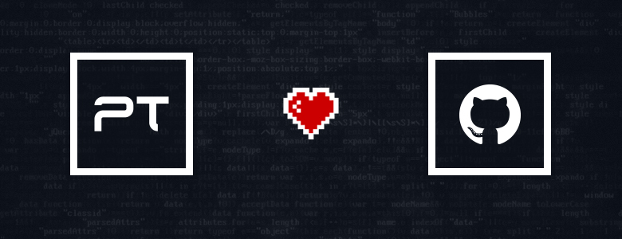
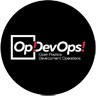

# Positive Technologies на GitHub

Поздравляю программистов с их профессиональным днем! В связи с этим праздником
наша компания Positive Technologies решила рассказать о своей деятельности,
напрямую связанной с разработкой, а именно с открытым исходным кодом и GitHub.

В последнее время все больше и больше компаний, таких как Google, Microsoft,
Facebook, JetBrains, выкладывают в открытый доступ исходный код как небольших,
так и крупных проектов. Positive Technologies славится не только
высококлассными специалистами по информационной безопасности, но и большим
количеством профессиональных разработчиков. Это позволяет ей также вносить свой
посильный вклад в развитие движения Open Source.

У PT есть следующие GitHub-организации, поддерживающие открытые проекты компании:

* [Positive Technologies](https://github.com/PositiveTechnologies)
* [Open DevOps Community](https://github.com/devopshq)
* [Positive Research](https://github.com/ptresearch)
* [Positive JS](https://github.com/positive-js)

<cut text="В статье описываются эти организации и их проекты">

Мы подробно описали первую организацию с ее проектами и кратко — все остальные.

# Содержание

* [Организации](#Организации)
  * [Positive Technologies](#positive-technologies)
  * [Open DevOps Community](#open-devops-community)
  * [Positive Research](#positive-research)
  * [Positive JS](#positive-js)
* [Проекты](#Проекты)
  * [PT.PM](#ptpm)
  * [Грамматики ANTLR](#Грамматики-antlr)
    * [PL/SQL](#plsql)
    * [T-SQL](#t-sql)
    * [MySQL](#mysql)
    * [PHP](#php)
    * [Java8](#java8)
    * [C#](#c)
    * [Разработка и перспективы](#Разработка-и-перспективы)
  * [PT.SourceStats](#ptsourcestats)
  * [AspxParser](#aspxparser)
  * [FP Community Rules](#fp-community-rules)
  * [Учебно-демонстрационные проекты](#Учебно-демонстрационные-проекты)
* [Заключение](#Заключение)

## Организации

### Positive Technologies

Основное сообщество, в котором ведется разработка как изначально открытых проектов,
так и тех, которые раньше разрабатывались исключительно внутри компании.
Также здесь размещаются учебные и демонстрационные проекты.

### Open DevOps Community

Цель сообщества — сформировать открытые готовые решения для управления полным
циклом процесса разработки, тестирования и смежных процессов, а также доставки,
развёртывания и лицензирования продуктов.

На данный момент сообщество находится в начальной стадии развития, но уже
сейчас в нем можно найти некоторые полезные инструменты, написанные на Python.
Да, мы его любим.

Активные проекты:

1. **[crosspm](https://github.com/devopshq/crosspm)** — универсальный пакетный
   менеджер, который позволяет скачивать пакеты для сборок многокомпонентных продуктов,
   используя правила, заданные в манифесте.
2. **[vspheretools](https://github.com/devopshq/vspheretools)** — инструмент,
   который позволяет управлять виртуальными машинами на vSphere прямо из консоли.
   Также есть возможность подключать его как API-библиотеку в своих Python-скриптах.
3. **[YouTrack Python 3 Client Library](https://github.com/devopshq/youtrack)** —
    Python-клиент для работы с API YouTrack.
4. **[TFS API Python client](https://github.com/devopshq/tfs)** — Python-клиент для
   работы с API Team Foundation Server от Microsoft.
5. **[A Python client for Artifactory](https://github.com/devopshq/artifactory)** —
   Python-клиент для работы с API хранилища бинарных данных Artifactory.
6. **[FuzzyClassificator](https://github.com/devopshq/FuzzyClassificator)** —
   универсальный [нейронечёткий классификатор](http://math-n-algo.blogspot.ru/2014/08/FuzzyClassificator.html)
   произвольных объектов, свойства которых могут быть оценены на нечёткой
   измерительной шкале.

Каждый инструмент имеет автоматическую сборку в Travis CI с выкладкой в
PyPI-репозиторий, где их можно найти и установить через стандартный pip install.

Готовятся к публикации еще несколько инструментов:

1. **CrossBuilder** — система организации кросс-платформенных сборок
   build as a code, а-ля Travis CI, но независящая от используемой CI-системы
   (TeamCity, Jenkins, GitLab-CI и т. п.).
2. **ChangelogBuilder** — генератор релиз-нотов с описанием изменений по продукту,
   который получает и агрегирует данные из различных трекеров (TFS, YouTrack, GitLab и т. п.).
3. **polyglot.sketchplugin** — плагин для системы Sketch, которым пользуются
   дизайнеры для упрощения работы с мультиязычной вёрсткой.

В качестве контрибьюторов любого инструмента приглашаются все желающие.
У нас есть типовой проект [ExampleProject](https://github.com/devopshq/ExampleProject),
в котором содержатся общая структура и подробная инструкция по созданию
собственного проекта в сообществе. Фактически достаточно его скопировать и
сделать свой проект по аналогии. Если у вас есть идеи или инструменты для
автоматизации чего-либо, давайте делиться ими с сообществом под MIT-лицензией!
Это модно, почётно, престижно :)

### Positive Research

Репозиторий, в котором публикуются некоторые исследовательские наработки, презентации,
утилиты (например, для определения уязвимостей), сигнатуры и методы определения атак.

* **[Pentest-Detections](https://github.com/ptresearch/Pentest-Detections)** —
  утилита, позволяющая быстро сканировать сеть (поддерживаеются IPv4 и IPv6) и
  определять уязвимости, которые эксплуатируют WannaCry, NotPetya.
* **[unME11](https://github.com/ptresearch/unME11)** — инструменты, позволяющие
  декодировать последние версии Intel ME 11.x.
* **[Bad_Tuesday_Cryptor_SIEM](https://github.com/ptresearch/Bad_Tuesday_Cryptor_SIEM)**
  — пакет MaxPatrol SIEM для борьбы с NotPetya.
* **[me-disablement](https://github.com/ptresearch/me-disablement)** — методы
  отключения Intel ME. В репозитории старый метод. Про новый метод с
  High Assurance Platform (HAP) можно почитать на хабре в статье
  [Выключаем Intel ME 11, используя недокументированный режим](https://habrahabr.ru/company/pt/blog/336242/).

#### [AttackDetection](https://github.com/ptresearch/AttackDetection)

В этот репозиторий команда обнаружения атак выкладывает правила для определения
эксплуатации уязвимостей с помощью систем обнаружения вторжений
[Snort](https://www.snort.org/) и [Suricata IDS](https://suricata-ids.org/).
Основная цель проекта — создание правил для уязвимостей, имеющих широкое
распространение и высокий уровень опасности (high impact). Репозиторий содержит файлы для
интеграции с [oinkmaster](http://oinkmaster.sourceforge.net/) —
скриптом для обновления и развертывания правил в указанных IDS.
А для теста самих правил прилагаются pcap-файлы с трафиком.
Стоит отметить, что репозиторий уже набрал свыше 100 добавлений в избранное,
а за год добавилось около 40 новых уязвимостей,
среди которых BadTunnel, ETERNALBLUE, ImageTragick, EPICBANANA, SambaCry.
Все анонсы о новых угрозах публикуются в [Twitter](https://twitter.com/attackdetection).

### Positive JS

Сообщество по разработке инструментария (преимущественно веб),
используемого в продуктах PT.

## Проекты

### [PT.PM](https://github.com/PositiveTechnologies/PT.PM)

**PT Pattern Matching Engine** — универсальный сигнатурный анализатор кода,
который принимает на вход пользовательские шаблоны, описанные на специальном
языке. Данный движок испольуется в бесплатном инструменте
для проверки веб-приложений на наличие уязвимых компонентов
**[Approof](https://approof.ptsecurity.ru/)**,
а также в анализаторе исходного кода **[PT Application Inspector](https://www.ptsecurity.com/ru-ru/products/ai/)**.

  

Процесс анализа состоит из нескольких этапов:

1. Парсинг исходного кода в дерево разбора.
2. Преобразование дерева в унифицированный формат.
3. Сопоставление дерева с пользовательскими шаблонами.

Реализованный в проекте подход дает возможность унифицировать задачу
разработки шаблонов под различные языки.

В PT.PM внедрена непрерывная интеграция, поддерживаются сборка и тестирование
модулей проекта как под Windows, так и под Linux (Mono).
Процесс разработки организуется с помощью размеченных метками задач (Issues)
и пул-реквестов. Наряду с разработкой ведется
[документация](https://github.com/PositiveTechnologies/PT.PM/wiki) проекта,
а результаты всех значимых сборок публикуются в формате как пакетов
[NuGet](https://www.nuget.org/packages/PT.PM/),
так и «сырых» [артефактов](https://ci.appveyor.com/project/KvanTTT/pt-pm/build/artifacts).
Организацию PT.PM, вероятно, можно считать образцовой,
к которой хотелось бы стремиться во всех остальных проектах.

Для первого этапа, а именно парсинга исходного кода, используются парсеры на базе ANTLR.
Этот инструмент генерирует их для различных языков (рантаймов)
на основе формальных грамматик, для которых существует репозиторий. Наша
компания его активно развивает. В настоящее время поддерживается генерация под
Java, C#, Python 2 и 3, JavaScript, C++, Go и Swift,
причём поддержка последних трех была добавлена совсем недавно.

Стоит отметить, что ANTLR используется не только в проектах PT направления Application Security,
но и в **[Max Patrol SIEM](https://www.ptsecurity.com/ru-ru/products/mpsiem/)**:
там он используется для обработки собственного языка DSL (Domain Specific Language),
который применяется для описания динамических групп активов.
Обмен опытом в этой сфере позволил не тратить время на задачи, которые уже были решены ранее.

### [Грамматики ANTLR](https://github.com/antlr/grammars-v4)

При участии Positive Technologies были разработаны и улучшены грамматики для
языков PL/SQL, T-SQL, MySQL, PHP, Java 8 и C#.

#### [PL/SQL](https://github.com/antlr/grammars-v4/tree/master/plsql)

Грамматики SQL имеют обширный синтаксис с большим количеством ключевых слов.
К счастью, грамматика PL/SQL существовала под ANTLR 3 и портировать её
под ANTLR 4 было не очень сложно.

#### [T-SQL](https://github.com/antlr/grammars-v4/tree/master/tsql)

Для T-SQL не было найдено достойных парсеров, не говоря уже об открытых,
и мы долго и кропотливо восстанавливали грамматику из документации MSDN.
Однако результат получился достойным: она уже охватывает
много распространённых синтаксических конструкций, опрятно выглядит,
независима от рантайма и покрыта тестами (примерами SQL-запросов из той же MSDN).
С 2015 в нее внесли свой вклад более 15 сторонних пользователей.
Более того, эта грамматика сейчас уже используется и в **DBFW**,
прототипе межсетевого экрана уровня систем управления базами данных,
подпроекте **[PT Application Firewall](https://www.ptsecurity.com/ww-en/products/af/)**.
**Денис Колегов** с **Арсением Реутовым** рассказывали о нем на PHDays VII:
[«Как разработать DBFW с нуля»](https://youtu.be/TzvB21GZgEY).

#### [MySQL](https://github.com/antlr/grammars-v4/tree/master/mysql)

Грамматика, разработанная вышеупомянутой командой, в первую очередь **Иваном Худяшовым** и
Денисом Колеговым, на основе T-SQL. Она также используется в DBFW.

#### [PHP](https://github.com/antlr/grammars-v4/tree/master/php)

Данная грамматика транслировалась из грамматики Bison в ANTLR.
Она интересна тем, что поддерживает парсинг сразу PHP, JavaScript и HTML.
Точнее, участки кода JavaScript и HTML парсятся в текст,
который позже обрабатывается парсерами конкретно под эти языки.

#### [Java8](https://github.com/antlr/grammars-v4/tree/master/java8-pt)

Эта грамматика была разработана совсем недавно. За основу была взята грамматика
предыдущей версии Java 7. Доработка была относительно быстрой, так как отличий
между версиями немного.

#### [C#](https://github.com/antlr/grammars-v4/tree/master/csharp)

Это по большей части экспериментальная грамматика, созданная для
сравнения скоростей парсеров на основе ANTLR и парсера Roslyn.

#### Разработка и перспективы

О деталях разработки грамматик можно почитать в нашей прошлогодней статье
[«Теория и практика парсинга исходников с помощью ANTLR и Roslyn»](https://habrahabr.ru/company/pt/blog/210772/).

Как видно по истории изменений, эти грамматики дорабатываются не только усилиями
Positive Technologies, но и большим количеством сторонних разработчиков.
За время этой кооперации репозиторий вырос не только количественно,
но и качественно.

### [PT.SourceStats](https://github.com/PositiveTechnologies/PT.SourceStats)

Позволяет собирать статистику для проектов на различных
языках программирования и используется в бесплатном продукте Approof.

### [AspxParser](https://github.com/PositiveTechnologies/AspxParser)

В рамках данного проекта разрабатывается парсер страниц ASPX,
который используется не только в открытом движке PT.PM,
но и во внутреннем анализаторе .NET-приложений (**AI.Net**),
основанном на абстрактной интерпретации кода.

### [FP Community Rules](https://github.com/PositiveTechnologies/FP-community-rules)

В репозитории идет разработка наборов правил в формате
[YARA](http://yara.readthedocs.io/en/v3.4.0/writingrules.html),
которые используются в модуле сигнатурного анализа проектов в Approof.
В августе прошлого года в рамках PDUG (юзер-группы по безопасной разработке)
**Алексей Гончаров** делал [доклад](https://youtu.be/LSEAQfVCuWY)
о модуле **FingerPrint**, используемом в PT AI и Approof.

Движок FingerPrint запускается на наборе исходных кодов сайта (бэкенда, фронтенда)
и в соответствии с описанными правилами YARA ищет известные версии сторонних
компонентов (например, библиотеку bla-bla версии 3). Правила составляются так,
что содержат сигнатуры уязвимых версии библиотек с текстовым описанием проблемы.

Правило представляет собой нескольких условий для проверки файла.
Например, условие наличия в файле определенных строк.
Если файл им удовлетворяет, то Approof в итоговом отчете выдает информацию
об обнаруженных уязвимостях в определенном компоненте с версией N,
а также описания относящихся к ним CVE.

Подробнее об этом можно почитать в статье Дениса Ефремова (ИСП РАН)
[«Разработка правил для Approof»](https://blog.llkl.org/rules-for-positive-technologies-Approof/).
Также см. его [доклад](https://www.youtube.com/watch?v=fN6I5E1UEtI)
«Автоматизация построения правил для Approof» на PDUG секции PHDays.

### Учебно-демонстрационные проекты

На PHDays VII в рамках PDUG прошел мастер-класс «Appsec Outback».
Для него были разработаны учебно-демонстрационные версии статического
анализатора кода [Mantaray](https://github.com/PositiveTechnologies/mantaray)
и межсетевого экрана [Schockfish](https://github.com/PositiveTechnologies/shockfish).
Данные проекты имеют все основные механизмы, которые используются
в реальных средствах защиты. Но, в отличие от последних, их основная цель
продемонстрировать алгоритмы и методы защиты, помочь понять процесс анализа
и защиты приложений, а также проиллюстрировать фундаментальные теоретические
возможности и ограничения технологий.

Также в репозитории имеются примеры реализации механизмов защиты:

* [DOMSanitizer](https://github.com/PositiveTechnologies/DOMSanitizer/) —
  модуль для обнаружения XSS-атак на стороне веб-браузера.
* [DOMParanoid](https://github.com/PositiveTechnologies/DOMParanoid/) —
  модуль (security linter) для проверки безопасности HTML.

## Лицензия

В наших проектах используются как разрешительные лицензии (MIT, Apache), так
и собственная, которая подразумевает бесплатное использование исключительно
в некоммерческих целях.

# Заключение

Процесс переезда на GitHub оказался полезным и дал нам опыт в различных областях —
в настройке DevOps под Windows и Linux, написании документации, в разработке.

Positive Technologies развивает Open Source проекты и планирует расширять эту
активность.