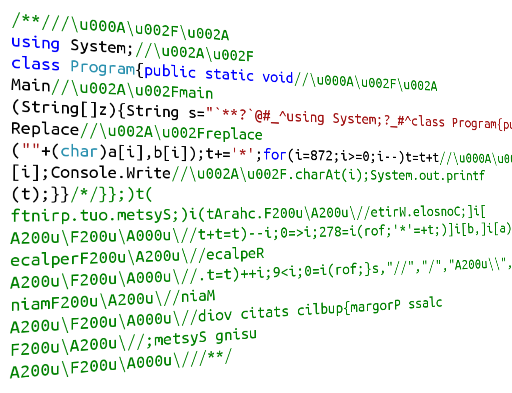

# How to write Palindrom Polyglot Quines



Congratulations to all the translators of human language to machine code with
their professional day! I wish you fewer bugs and a greater number of cool
ideas! And as a gift, I offer a solution to one beautiful task - writing code
that outputs its own text, is valid for interpreters and compilers of different
languages, and is correctly executed when reversing its sources.

Not so long ago I learned about code that can be both interpreted in PHP and
compiled to Java:
[PhpJava.java](https://gist.github.com/forairan/b1143f42883b3b0ee1237bc9bd0b7b2c).
As it turned out, this idea is not new: code which is valid for several
compilers or interpreters is called a
[polyglot](https://en.wikipedia.org/wiki/Polyglot_(computing)). It is possible
to write such code because of the peculiarities of processing strings and
comments in different interpreters or compilers.

<cut/>

For example, in Java, you can describe characters in the usual way, such as the
character '/', or encoded as a Unicode character: 'u002F'. In the C\# compiler,
these entries will not be valid. However, if they are "hidden" inside a comment,
then on the one hand they will not interfere with the compilation of C# code, on
the other hand they will be valid in Java code. For example, if you want code
**A** to be compiled only in C# but not in Java, and code **B** to be compiled
only in Java but not in C#, you should use the following fragment:

```
//\u000A\u002F\u002A
A//\u002A\u002FB
```

C#-compiler will interpret this code in the usual way, comments will remain
comments:

```csharp
//\u000A\u002F\u002A
A//\u002A\u002FB
```

But it is more interesting with Java, as Unicode characters will transform and
the following will remain:

```java
//
/*
A//*/B
```

By combining instructions which are valid for both languages and dividing the
differences, you can write any program.

Tricks with Unicode characters are not the only way. For example, in C-like
languages, there are preprocessor directives that can determine which code
should be compiled and which should not. You can put code of a completely
different language into uncompiled code. For example, below you can find a
polyglot code in C++ and Python ([taken from
here](https://gist.github.com/LionZXY/5916ce355d08d6d43a8b6acd71951c25)), where
`#if false` section contains Python code. And the sequences `'''` start and
finish comments in Python.

```c
#include <stdio.h>
#if false
print "Hello world"
'''
#endif
int main() {
printf("Hello world");
return 0;
}
#if false
'''
#endif
```

In HTML, for example, comments begin with the sequence `<!--`, which can also be
used. There are also more complex polyglots which work simultaneously in six or
even sixteen languages. The first polyglot displays "hitforum" message for all
languages, and the second one works more interestingly: it displays the name of
the language in which it is compiled or interpreted.

### Polyglot code in C, Shell, Perl, Brainfuck, Befunge, Whitespace

```c
# define x u    /*            v
#    :::::::::::::::::::>>>>>>>$$$a"muroftih"#[>:#,_@]
eval 'echo "hitforum";exit';sub echo { print    "@_\n"}               
__END__>++++++++++>++++++++++[>+++++++++++>++++++++++    
+<<-]>------.+.>++++++.<---.+++++++++.>--.+++                        
.<--.<<.    */
main() { printf ("hitforum\n"); }
```

<details>
<summary>Polyglot code in 16 languages</summary>

```perl
# /* [	<!-- */ include	<stdio.h> /* 	\
	#`{{coding=utf-8\
"true" if 0 != 0 and	q != """0"	;	`	\
	\
if [ -n "$ZSH_VERSION" ]; then		 		 	\
	\
    echo exec	echo I\'m a zsh script.; \
	\
elif [ -n "$BASH_VERSION" ]; then		    	\
	\
    echo exec	echo I\'m a bash script.; \
else	\
    echo exec	echo	I\'m	a sh	script.;		\
fi`;	#!;#\
BEGIN{print"I'm a ", 0 ? "Ruby"	:"Perl",	" program.\n";	exit; }  
	#\
%q~     		 	  	
	
set =dummy 0; puts [list "I'm"	"a"	"tcl"	"script."]; exit	  
	
all: ; @echo "I'm a Makefile."		  	 	\
	#*/
/*: */ enum {a, b}; 			  		\
	\
static int c99(void) {  			    
	
 #ifndef __cplusplus /* bah */		    	
	
unused1: if ((enum {b, a})0) 		   		\
	(void)0;
 #endif    		  	 	
	
unused2:    return a;	     \
}	\
static int trigraphs(void) {  			    \
	\
    return sizeof	"??!"	==	2;  	 \
}	\
char X;    		 				\
	\
int main(void) {   		  			\
	\
    struct X	{		  	 \
	\
     	char	a[2];    	\
	};\
    if (sizeof(X)	!=	1) {		 	\
	\
printf("I'm a C++ program (trigraphs %sabled).\n",	 			 \
	\
     trigraphs()	? "en"	: "dis");\
	\
}else if (1//**/2


)unused3 : { ; \
        printf("I'm a C program (C%s, trigraphs %sabled).\n", \
               c99() ? "89 with // comments" : "99", \
               trigraphs() ? "en" : "dis"); \
    } else { \
        printf("I'm a C program (C89, trigraphs %sabled).\n", \
               trigraphs() ? "en" : "dis"); \
    } \
    return 0; \
} /*
 # \
\begin{code}
import Prelude hiding ((:)); import Data.List (intercalate); import Language.Haskell.TH; import Data.String; default (S, String, Integer, Double); data S = S; instance Eq S where { _ == _ = False }; instance IsString S where { fromString = const S }; ifThenElse c t e = case c of True -> t; False -> e
cPP = False; {-
#define cPP True
-} main :: IO ()
main = putStr ("I'm a Literate Haskell program" ++ bonus ++ ".\n") where
  _ = (); bonus | null details = "" | otherwise = " (" ++ details ++ ")"
  details = intercalate ", " [ name | (True, name) <- extensions ] :: String
  extensions =
    (bangPatterns,              "BangPatterns"             ) :
    (templateHaskell,           "TemplateHaskell"          ) :
    (rebindableSyntax,          "RebindableSyntax"         ) :
    (magicHash,                 "MagicHash"                ) :
    (overloadedStrings,         "OverloadedStrings"        ) :
    (noMonomorphismRestriction, "NoMonomorphismRestriction") :
    (scopedTypeVariables,       "ScopedTypeVariables"      ) :
    (cPP,                       "CPP"                      ) :
    (unicodeSyntax,             "UnicodeSyntax"            ) :
    (negativeLiterals,          "NegativeLiterals"         ) :
    (binaryLiterals,            "BinaryLiterals"           ) :
    (numDecimals,               "NumDecimals"              ) : []
  (!) = (!!)
  bangPatterns = [True] ! 0 where foo !bar = False
  templateHaskell = thc $(return (TupE []) :: ExpQ)
  rebindableSyntax = null (do { [()]; [()] })
    where _ >> _ = [] :: [()]
  magicHash = foo# () where
    foo = ['.']; "." # _  = False; foo# _ = True
  overloadedStrings = "" /= ""
  noMonomorphismRestriction = show foo == "0" where
    foo = 0
    bar = foo :: Double
  unicodeSyntax = let (★) = True in (*) where
    (*) = False
  negativeLiterals = -1 == NNa
  binaryLiterals = let b1 = 1 in 0b1 == 1
  numDecimals = show 0e0 == "0"
  scopedTypeVariables = stv (0 :: Double) == "0.0"
data{- = -} NN = NNa | NNb deriving Eq; instance Num NN where { fromInteger _ = NNa; negate _ = NNb; _ + _ = NNa; _ * _ = NNa; abs _ = NNa; signum _ = NNa }
instance{- = -} (Num a) => Num (e -> a) where { fromInteger = const . fromInteger; negate = (.) negate; abs = (.) abs; signum = (.) signum; x + y = \e -> x e + y e; x * y = \e -> x e * y e }
class THC a where { thc :: a -> Bool }; instance THC () where { thc _ = True }; instance THC (Q a) where { thc _ = False }; class (Show a, Num a) => STV a where
  stv :: a -> String
  stv = const $ show (f 0) where
    f = id :: a -> a
instance STV Double -- : \
\end{code}

 # \
]>++++++++[<+++++++++>-]<+.>>++++[<++++++++++>-]<-.[-]>++++++++++ \
[<+++++++++++>-]<-.>>++++[<++++++++>-]<.>>++++++++++[<++++++++++> \
-]<- - -.<.>+.->>++++++++++[<+++++++++++>-]<++++.<.>>>++++++++++[ \
<++++++++++>-]<+++++.<<<<+.->>>>- - -.<+++.- - -<++.- ->>>>>+++++ \
+++++[<+++++++++++>-]<- - -.<<<<<.<+++.>>>.<<<-.- ->>>>+.<.<.<<.> \
++++++++++++++.[-]++++++++++""" else 0
 # \
from platform import * # \
print("I'm a Python program (%s %s)." % # [-][ \
(python_implementation(), python_version())); """--><html><head>
<!--:--><title>I'm a HTML page</title></head><body>
<!--:--><h1>I'm a <marquee><blink>horrible HTML</blink></marquee> page</h1>
<!--:--><script language="JavaScript">
<!--: # \
setTimeout( // \
   function () { // \
      document.body.innerHTML = "<h1>I'm a javascript-generated HTML page</h1>"; // \
   }, 10000); // \
//-->
</script><!--: \
</body></html><!-- }} # \
say "I'm a Perl6 program."; # """ # */
 #define FOO ]-->~
```

</details>

## Polyglot quine

In order to write a polyglot quine in C# and Java, it is necessary to combine
the principles of developing a quine and a polyglot. As it turned out, this
topic is not new: on Codegolf site, users compete, whose polyglot quine, or
polyquine, is shorter: [Write a
Polyquine](https://codegolf.stackexchange.com/q/37464/15660).
However, in this question there were no variants with more verbose languages
like C# and Java, and I wanted to fix that.

For this polyglot quine, you need to escape characters which are forbidden in
the lines of both languages and occur in the lines of the program itself. These
characters are quotes `"`, line break `\n` and the backslash `\`. And to reduce
the size of the code, duplicate character sequences such as `\u000A`, `\u002F` and
`\u002A` were also replaced with single characters in the encoding line. Here is
an example of the resulting polyglot quine, which is valid for C# and Java
compilers:

### PolyglotQuine.cs.java, 757 symbols

```csharp
//\u000A\u002F\u002A
using System;//\u002A\u002F
class Program{public static void//\u000A\u002F\u002A
Main//\u002A\u002Fmain
(String[]z){String s="//@#'^using System;//'#^class Program{public static void//@#'^Main//'#main^(String[]z){String s=!$!,t=s;int[]a=new int[]{33,94,38,64,35,39,36};String[]b=new String[]{!&!!,!&n!,!&&!,!&@!,!&#!,!&'!,s};for(int i=0;i<7;i++)t=t.//@#'^Replace//'#replace^(!!+(char)a[i],b[i]);//@#'^Console.Write//'#System.out.printf^(t);}}",t=s;int[]a=new int[]{33,94,38,64,35,39,36};String[]b=new String[]{"\"","\n","\\","\\u000A","\\u002F","\\u002A",s};for(int i=0;i<7;i++)t=t.//\u000A\u002F\u002A
Replace//\u002A\u002Freplace
(""+(char)a[i],b[i]);//\u000A\u002F\u002A
Console.Write//\u002A\u002FSystem.out.printf
(t);}}
```

## Palindrome polyglot quine

Let's complicate the task even more: try to write a palindrome polyglot quine. I
remind you that a palindrome is a number or a text which reads the same backward
as forward. I described the principle of developing palindrome quines in the
[article](https://habrahabr.ru/post/189192/) 3 years ago (it was also the Day of
the Programmer). The principle of the palindrome code is that the mirror part of
the program is placed in a single-line or multi-line comment, which does not
interfere with compilation. The simplest palindrome code in C# looks like this:

```csharp
/**/class P{static void Main(){}};/*/;}}{)(niaM diov citats{P ssalc/**/
```

As you can see, the multi-line comment `/*` starts from the middle and continues
to the end, where it is closed by the sequence `*/`. A blank comment at the
beginning is necessary for the line to become completely symmetric.

So, combining the principles of developing a palindrome, a polyglot and a quine,
I wrote the following code:

### PalindromePolyglotQuine.cs.java, 1747 symbols

```csharp
/**///\u000A\u002F\u002A
using System;//\u002A\u002F
class Program{public static void//\u000A\u002F\u002A
Main//\u002A\u002Fmain
(String[]z){String s="`**?`@#_^using System;?_#^class Program{public static void?@#_^Main?_#main^(String[]z){String s=!$!,t=s;int i;int[]a=new int[]{33,94,38,64,35,95,96,63,36};String[]b=new String[]{!&!!,!&n!,!&&!,!&@!,!&#!,!&_!,!`!,!?!,s};for(i=0;i<9;i++)t=t.?@#_^Replace?_#replace^(!!+(char)a[i],b[i]);t+='*';for(i=872;i>=0;i--)t=t+t?@#_^[i];Console.Write?_#.charAt(i);System.out.printf^(t);}}/",t=s;int i;int[]a=new int[]{33,94,38,64,35,95,96,63,36};String[]b=new String[]{"\"","\n","\\","\\u000A","\\u002F","\\u002A","/","//",s};for(i=0;i<9;i++)t=t.//\u000A\u002F\u002A
Replace//\u002A\u002Freplace
(""+(char)a[i],b[i]);t+='*';for(i=872;i>=0;i--)t=t+t//\u000A\u002F\u002A
[i];Console.Write//\u002A\u002F.charAt(i);System.out.printf
(t);}}/*/}};)t(
ftnirp.tuo.metsyS;)i(tArahc.F200u\A200u\//etirW.elosnoC;]i[
A200u\F200u\A000u\//t+t=t)--i;0=>i;278=i(rof;'*'=+t;)]i[b,]i[a)rahc(+""(
ecalperF200u\A200u\//ecalpeR
A200u\F200u\A000u\//.t=t)++i;9<i;0=i(rof;}s,"//","/","A200u\\","F200u\\","A000u\\","\\","n\",""\"{][gnirtS wen=b][gnirtS;}63,36,69,59,53,46,83,49,33{][tni wen=a][tni;i tni;s=t,"/}};)t(^ftnirp.tuo.metsyS;)i(tArahc.#_?etirW.elosnoC;]i[^_#@?t+t=t)--i;0=>i;278=i(rof;'*'=+t;)]i[b,]i[a)rahc(+!!(^ecalper#_?ecalpeR^_#@?.t=t)++i;9<i;0=i(rof;}s,!?!,!`!,!_&!,!#&!,!@&!,!&&!,!n&!,!!&!{][gnirtS wen=b][gnirtS;}63,36,69,59,53,46,83,49,33{][tni wen=a][tni;i tni;s=t,!$!=s gnirtS{)z][gnirtS(^niam#_?niaM^_#@?diov citats cilbup{margorP ssalc^#_?;metsyS gnisu^_#@`?**`"=s gnirtS{)z][gnirtS(
niamF200u\A200u\//niaM
A200u\F200u\A000u\//diov citats cilbup{margorP ssalc
F200u\A200u\//;metsyS gnisu
A200u\F200u\A000u\///**/
```

Unfortunately, this monster turned out to be too big (1747 symbols), but this is
explained by long Unicode strings and verbosity of C# and Java languages. I'm
sure that in other languages it will be possible to write a palindrome polyglot
quine of a much smaller size.

Now let's check how this program is executed. First, get rid of all comments and
format the code correctly:

<details> <summary>Formatted and cleared code of PalidromePolyglotQuine.cs.java
in C#</summary>

```csharp
using System;
class Program
{
    public static void Main(String[] z)
    {
        String s = "`**?`@#_^using System;?_#^class Program{public static void?@#_^Main?_#main^(String[]z){String s=!$!,t=s;int i;int[]a=new int[]{33,94,38,64,35,95,96,63,36};String[]b=new String[]{!&!!,!&n!,!&&!,!&@!,!&#!,!&_!,!`!,!?!,s};for(i=0;i<9;i++)t=t.?@#_^Replace?_#replace^(!!+(char)a[i],b[i]);t+='*';for(i=872;i>=0;i--)t=t+t?@#_^[i];Console.Write?_#.charAt(i);System.out.printf^(t);}}/",
            t = s;
        int i;
        int[] a = new int[] { 33, 94, 38, 64, 35, 95, 96, 63, 36 };
        String[] b = new String[] { "\"", "\n", "\\", "\\u000A", "\\u002F", "\\u002A", "/", "//", s };
        for (i = 0; i < 9; i++)
            t = t.Replace("" + (char)a[i], b[i]);
        t += '*';
        for (i = 872; i >= 0; i--)
            t = t + t[i];
        Console.Write(t);
    }
}
```

</details>

From the listing it becomes clear that the variable `s` contains the code of the
program, where characters prohibited in the lines are escaped, and duplicate
sequences are compressed. Below is a table of symbols which is used to form the
output string `t`.

| Code | Symbol | Replacement |
|----|---|--------|
| 33 | ! | "      |
| 94 | ^ | \n     |
| 38 | & | \      |
| 64 | @ | \u000A |
| 35 | # | \u002F |
| 95 | _ | \u002A |
| 96 | ` | /      |
| 63 | ? | //     |
| 36 | $ | s      |

Next, the string `t` is concatenated with the inversion of itself so that the
output is a palindrome. It is worth noting that the number 872 (the length of
the string `t`) must be calculated after the quine has already been written. To
do this, it is necessary to run the written code, which can also present
particular difficulties.

The main criteria when writing such code was to achieve the smallest text size,
not the purity of the code. Therefore, of course, it looks somewhat strange.

So, you can see that there is nothing difficult in writing such quines. For
those who don't believe that this really works, there are several tests in the
repository
[Freaky-Sources](https://github.com/KvanTTT/Freaky-Sources/blob/master/FreakySources.Tests/QuineTests.cs)
(to run them, you need Java to be installed).

Share in the comments the code of your quines-palindromes-polyglots in other
languages or other interesting code-freaky things, I'll read them with pleasure.

Once again, I congratulate all programmers and sympathizers!